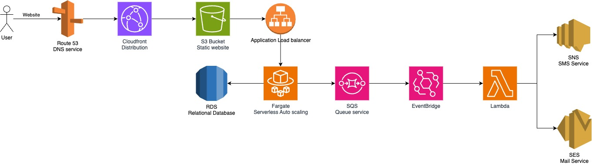

Patient Registration API
========================

Este es un proyecto de API para el registro de pacientes, desarrollado con FastAPI y SQLAlchemy. Permite registrar pacientes, almacenar sus datos y enviar correos electrónicos de confirmación.

📁 Estructura del Proyecto
--------------------------

```
PATIENT-REGISTRATION-API/
│── app/
│   ├── api/
│   │   ├── patients.py       # Endpoints de la API
|   ├── cerely/
|   |   ├── cerely.py         # Configuracion de cerely
│   ├── db/
│   │   ├── database.py       # Configuración de la base de datos
│   ├── models/
│   │   ├── patient.py        # Definición del modelo de datos
│   ├── schemas/
│   │   ├── patient.py        # Esquemas Pydantic para validación de datos
│   ├── services/
│   │   ├── base.py           # Creamos familias y metodos abstractos para notificaciones
│   │   ├── email_service.py  # Servicio de envío de correos electrónicos
│   │   ├── sms_service.py    # Servicio de envio de mensajes sms
│   ├── config.py             # Configuración del proyecto
│   ├── main.py               # Punto de entrada de la API
│── locust/
│   ├── Dockerfile            # Docker para inicializar locust
│   ├── locustfile.py         # Configuracion de locust 
│   ├── requirements.txt      # Librereias que usa el contenedor de locust
│── .env                      # Variables de entorno
│── .gitignore                # Archivos ignorados por Git
│── compose.yaml              # Configuración para Docker Compose
│── Dockerfile                # Dockerización del proyecto
│── README.md                 # Documentación del proyecto
│── requirements.txt          # Dependencias del proyecto
```

🚀 Instalación y Configuración
------------------------------

### 1️⃣ Clonar el repositorio

` git clone https://github.com/tu-usuario/patient-registration-api.git  cd patient-registration-api `

### 2️⃣ Build de los contenedores

``docker compose build``

### 3️⃣ Levantar los contenedores

``docker compose up``

### 4️⃣ Ejecutar la API

``Peticion post con formato:``

La API estará disponible en http://0.0.0.0:8000.

## 🛠️ Endpoints Principales

### 📍 Registro de Paciente

**POST** `/register`

*   **Descripción**: Registra un nuevo paciente en la base de datos.
     
*   **Payload:**
     
     ```
     {
       "name": "John Doe",
       "email": "john@example.com",
       "phone": "+1234567890",
       "document_url": "https://img.freepik.com/free-photo/lifestyle-people-emotions-casual-concept-confident-nice-smiling-asian-woman-cross-arms-chest-confident-ready-help-listening-coworkers-taking-part-conversation_1258-59335.jpg"
     }
     ```
     
*   **Respuesta:**
     
     ```
        {
            "id": 1,
            "name": "Jon Doeh",
            "email": "john@example.com",
            "phone": "+1234567890",
            "document_url": "https://img.freepik.com/free-photo/lifestyle-people-emotions-casual-concept-confident-nice-smiling-asian-woman-cross-arms-chest-confident-ready-help-listening-coworkers-taking-part-conversation_1258-59335.jpg"
        }
     ```
     

### 📍 Obtener Pacientes

**GET** `/getPatients`

*   **Descripción**: Devuelve la lista de pacientes registrados.
     
*   **Respuesta:**
     ```
     [
       {
         "id": 1,
         "name": "John Doe",
         "email": "john@example.com"
       }
     ]
     ```     

### 📍 Obtener un Paciente por ID

**GET** `/patients/getPatientById/{id}`

*   **Descripción**: Retorna los detalles de un paciente específico.
     
*   **Respuesta:**
     ```
        {
            "id": 3,
            "name": "Jon Doeh",
            "email": "john@example.com",
            "phone": "+59896689795",
            "document_url": "https://img.freepik.com/free-photo/lifestyle-people-emotions-casual-concept-confident-nice-smiling-asian-woman-cross-arms-chest-confident-ready-help-listening-coworkers-taking-part-conversation_1258-59335.jpg"
        }
     ```  

### 📍 Eliminar un Paciente

**DELETE** `/patients/deletePatientById/{id}`

*   **Descripción**: Elimina un paciente de la base de datos.
    
*   **Respuesta:**
```
    {
    "message": "Paciente con ID 3 eliminado correctamente"
    }
 ```  

* * *

## 📧 Servicio de Notificaciones

### Arquitectura de Notificaciones

El proyecto implementa un sistema de notificaciones flexible y escalable utilizando el patrón de diseño de Servicios Abstractos y Celery para el manejo asíncrono de tareas.

#### Componentes Principales

1.  **Base Abstracta de Notificaciones** (`services/base.py`)* *   Define una interfaz abstracta `NotificationService` que permite crear diferentes tipos de servicios de notificación.
    *   Implementa una clase `NotificationManager` que gestiona los diferentes servicios de notificación.

```
class NotificationService(ABC):
    @abstractmethod
    def send(self, recipient: str, message: str, **kwargs) -> None:
        """Método abstracto para enviar notificaciones"""
        pass
```

2.  **Servicio de Email** (`services/email_service.py`)* *   Utiliza Celery para el envío asíncrono de correos electrónicos.
    *   Implementa una tarea de Celery `send_email_sync` que maneja el envío real del correo.
    *   Proporciona una función `send_confirmation_email` para encolar tareas de envío de correo.

'''
@shared_task(bind=True, max_retries=3)
def send_email_sync(self, to_email: str, subject: str, body: str):
    # Lógica de envío de correo electrónico
    pass
'''

3.  **Servicio de SMS** (`services/sms_service.py`)* *   Preparado para futuras implementaciones de notificaciones por SMS.
    *   Seguirá el mismo patrón de diseño que el servicio de email.

#### Flujo de Notificaciones

1.  Cuando se registra un paciente, se crea una instancia de `NotificationManager`.
2.  El método `send_notification` selecciona el servicio de notificación apropiado.
3.  El servicio envía la notificación utilizando Celery, sin bloquear la respuesta de la API.

```
notification_manager = NotificationManager()
notification_manager.send_notification(
    type='email', 
    recipient=patient_data.email, 
    message="Tu registro fue exitoso. Gracias por unirte."
)
```

### Beneficios de la Arquitectura

*   **Flexibilidad**: Fácil adición de nuevos canales de notificación.
*   **Desacoplamiento**: Cada servicio de notificación es independiente.
*   **Escalabilidad**: Preparado para integrar múltiples tipos de notificaciones.
*   **Asincronía**: Uso de Celery para envío no bloqueante de notificaciones.

### Extensibilidad para SMS

Para añadir notificaciones por SMS en el futuro:

1.  Implementar una tarea de Celery similar a `send_email_sync`.
2.  Crear un `SMSNotificationService` en `sms_service.py`.
3.  Añadir el servicio al `NotificationManager`.

* * *

# 🛠️ Arquitectura del Proyecto

## **Arquitectura General**

Este proyecto está diseñado para manejar el registro de pacientes a través de una API desarrollada con FastAPI y SQLAlchemy. Además, incluye una integración con **Celery** para realizar tareas asíncronas (como el envío de correos electrónicos de confirmación) y **Redis** como broker para las tareas de Celery. Para probar la escalabilidad de la API, se utiliza **Locust** para realizar pruebas de carga.

### **Componentes Principales**

*   **FastAPI**: Framework para construir la API de registro de pacientes.
     
*   **SQLAlchemy**: ORM para interactuar con la base de datos.
     
*   **Celery**: Sistema de tareas asíncronas para manejar operaciones que pueden tomar tiempo, como el envío de correos electrónicos.
     
*   **Redis**: Broker de mensajes utilizado por Celery para gestionar las tareas en cola.
     
*   **Locust**: Herramienta de pruebas de carga para simular múltiples usuarios interactuando con la API.
     

## **Flujo de Arquitectura**

1.  **Registro de Pacientes**: Un usuario realiza una solicitud `POST` a la API para registrar un paciente. Los datos del paciente se almacenan en la base de datos.
     
2.  **Correo de Confirmación Asíncrono**: Una vez que el paciente es registrado, se envía un correo electrónico de confirmación usando Celery. Esta tarea se maneja de manera asíncrona para no bloquear la respuesta del servidor.
     
3.  **Redis y Celery**: Celery usa Redis como un sistema de cola para gestionar las tareas de manera eficiente. Redis almacena las tareas pendientes y Celery las procesa cuando los recursos están disponibles.
     
4.  **Pruebas de Carga con Locust**: Utilizamos Locust para simular múltiples usuarios realizando peticiones a la API, de modo que podamos evaluar su rendimiento bajo carga.
     

* * *

## **Configuración de Redis y Celery**

### **¿Qué es Redis?**

**Redis** es una base de datos en memoria que se utiliza como broker de mensajes para Celery. En este proyecto, Redis se encarga de gestionar las tareas asíncronas, como el envío de correos electrónicos. Actúa como intermediario entre la API y el worker de Celery.

### **¿Qué es Celery?**

**Celery** es un sistema distribuido de tareas asíncronas que permite ejecutar funciones en segundo plano. En este proyecto, usamos Celery para enviar correos electrónicos de manera asíncrona. Esto significa que cuando un paciente se registra, la API no tiene que esperar a que se envíe el correo electrónico para responder al usuario, mejorando la eficiencia del sistema.

**Configuración de Celery:**

En el archivo `cerely.py`, definimos la configuración de Celery, que incluye la conexión a Redis como broker de tareas.

```
from celery import Celery
import os

# Configuración de Celery con Redis como broker
celery = Celery('tasks', broker=os.getenv('REDIS_URL'))
celery.conf.result_backend = os.getenv('REDIS_URL')
```

Para ejecutar Celery con Redis, necesitamos tener ambos servicios (Redis y Celery) corriendo. Esto se logra con los contenedores Docker que hemos configurado.

* * *

## **Configuración de Locust para Pruebas de Carga**

### **¿Qué es Locust?**

**Locust** es una herramienta de pruebas de carga fácil de usar que nos permite simular múltiples usuarios interactuando con la API. En este proyecto, usamos Locust para generar tráfico de usuarios y evaluar cómo se comporta la API bajo condiciones de carga alta.

### **Configuración de Locust:**

El archivo `locustfile.py` define cómo se realizará la prueba de carga. En nuestro caso, simulamos usuarios que crean pacientes de manera constante:

```
from locust import HttpUser, task, between 
from faker import Faker  

fake = Faker()  
class PatientLoadTest(HttpUser):     
    wait_time = between(3, 5)  # Tiempo de espera entre las peticiones      
    
    @task     
    def create_patient(self):         
        payload = {
            "name": fake.name(),
            "email": fake.unique.email(),
            "phone": fake.phone_number(),
            "document_url": fake.url()
        }
        response = self.client.post("/patients/register", json=payload)
        print(response.status_code, response.text)

```

El código anterior simula la creación de pacientes con datos aleatorios generados por la librería **Faker**. La clase `PatientLoadTest` es responsable de hacer peticiones `POST` a la API y registrar pacientes en la base de datos.

### **Dockerfile de Locust:**

El Dockerfile de Locust asegura que la herramienta se ejecute en un contenedor aislado:

````
FROM locustio/locust

WORKDIR /mnt/locust

COPY requirements.txt .
RUN pip install --no-cache-dir -r requirements.txt

COPY . .  
CMD ["-f", "/mnt/locust/locustfile.py", "--host=http://app:8000"]
````

Con este Dockerfile, creamos un contenedor de Locust que ejecuta el archivo `locustfile.py` y realiza pruebas de carga contra la API en el contenedor de la aplicación (`http://app:8000`).

### **Cómo Ejecutar Locust:**

Para ejecutar las pruebas de carga, asegúrate de que los contenedores de la aplicación y Locust estén corriendo. Luego, abre un navegador y ve a la dirección `http://localhost:8089`, donde podrás configurar la cantidad de usuarios virtuales y la tasa de peticiones por segundo. Locust se encargará de generar el tráfico y mostrará estadísticas en tiempo real.

* * *

## **Dockerización del Proyecto**

El proyecto está completamente dockerizado para facilitar su implementación en cualquier entorno. Se usan varios contenedores para separar las responsabilidades:

*   **Contenedor de la API**: Contiene la aplicación FastAPI.
   
*   **Contenedor de Redis**: Actúa como el broker para Celery.
     
*   **Contenedor de Celery**: Ejecuta las tareas asíncronas (como el envío de correos electrónicos).
     
*   **Contenedor de Locust**: Ejecuta las pruebas de carga.

*   **Contenedor de Base de datos MySQL**: Instancia de base de datos donde se guardan los datos de los pacientes

* * *

# 🚀 Arquitectura en Producción

Esta sección describe la arquitectura de la aplicación en producción utilizando exclusivamente servicios de AWS. La infraestructura está diseñada para ser altamente escalable, segura y sin necesidad de administrar servidores manualmente.

## 📌 Diagrama de Arquitectura




* * *

## 🏗️ **Explicación de la Arquitectura**

### **1️⃣ Frontend: Hosting y Distribución**

*   **Route 53 (DNS Service):** Gestiona el dominio y redirige las solicitudes al sitio web.
     
*   **CloudFront (CDN):** Acelera la entrega del sitio web estático almacenado en **S3**.
     
*   **Amazon S3 (Static Website Hosting):** Almacena los archivos estáticos de la web.
     

✅ **Razón:** CloudFront mejora la velocidad y seguridad, y S3 reduce costos al no requerir servidores dedicados.

* * *

### **2️⃣ Backend: Procesamiento de Datos**

*   **Application Load Balancer (ALB):** Distribuye el tráfico entre múltiples instancias de backend.
     
*   **AWS Fargate (Serverless Containers - ECS):** Maneja la lógica del negocio sin necesidad de administrar servidores.
     
*   **Amazon RDS (Relational Database Service):** Almacena datos estructurados de usuarios y transacciones.
     

✅ **Razón:** Fargate escala automáticamente sin gestionar servidores, y RDS garantiza integridad y eficiencia en consultas SQL.

* * *

### **3️⃣ Procesamiento Asíncrono: Envío de Correos y SMS**

*   **Amazon SQS (Simple Queue Service):** Recibe solicitudes de Fargate para procesar emails/SMS sin bloquear la aplicación.

*   **Amazon EventBridge:** Su función es detectar eventos y activar acciones automáticamente. Lambda puede leer directamente desde SQS, pero EventBridge permite más flexibilidad en la gestión de eventos, como agregar reglas para priorizar ciertos tipos de mensajes, activar múltiples Lambdas, etc.

*   **AWS Lambda:** Procesa los mensajes de SQS y decide si enviar email o SMS.
     
*   **Amazon SES (Simple Email Service):** Envía emails transaccionales.
     
*   **Amazon SNS (Simple Notification Service):** Envía SMS a los usuarios.
     

✅ **Razón:** SQS desacopla la lógica, Lambda permite ejecución sin servidores, SES es la opción más económica para emails y SNS para SMS.